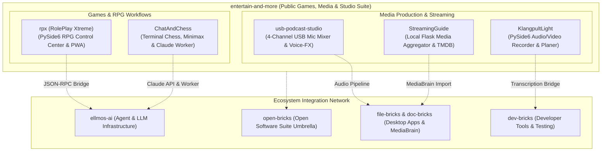

  

  
  
  
  
  
  
  

# entertain-and-more

**Local-first entertainment tools, games, podcast studios, media discovery, and AI-assisted RPG game-master workflows.**

entertain-and-more is the entertainment and creative media branch of the `open-bricks` and `ellmos` ecosystem. The repositories here focus on practical, inspectable local-first software: terminal chess with optional Claude API integration, tabletop role-playing support systems (rpx), USB microphone podcast studios, streaming content availability guides, and live audio/video recording software. Every application is built to keep user data local while offering optional AI enhancement layers for players, creators, and Game Masters.

> [!NOTE]
> **Public Navigation Index:** Refreshed against live GitHub API metadata on **2026-07-28**. Every public repository visible in `entertain-and-more` (5 active software projects plus 1 profile repository) is 100% indexed here. Private or internal work is intentionally omitted.

> [!TIP]
> **Local-First & Offline Resilience:** All applications in `entertain-and-more` operate fully offline by default. AI features (such as Anthropic API modes, Claude Code file-worker integration, TMDB/Claude CLI discovery, and JSON-RPC control bridges) are optional layers designed to enhance gameplay and studio workflows without requiring cloud lock-in for core functions.

## Start Here

| Need | Repository | Best Entry Point |
|---|---|---|
| Play or study a Python chess game with local play, Minimax, and optional Claude modes | [ChatAndChess](https://github.com/entertain-and-more/ChatAndChess) | Rules, tactics analyzer, worker mode, and test workflow |
| Run a tabletop RPG control center for sessions, maps, music, player screens, and AI prompts | [rpx](https://github.com/entertain-and-more/rpx) | RPX Pro dashboard, campaign bundle, JSON-RPC, and PWA companion |
| Record podcasts locally with dual USB microphones, 4-channel mixer, and DSP voice FX | [usb-podcast-studio](https://github.com/entertain-and-more/usb-podcast-studio) | USB mixer hub, Voice-FX pipeline, webcam capture, and project assets |
| Track film/series availability per profile and discover new titles via TMDB & AI | [StreamingGuide](https://github.com/entertain-and-more/StreamingGuide) | Per-profile tracking, TMDB availability grid, and AI discover cache |
| Capture audio/video and plan episodes with live transcription & teleprompter | [KlangpultLight](https://github.com/entertain-and-more/KlangpultLight) | PySide6 Recorder desktop app and Web Planer episode dashboard |
| Understand this organization profile and shared community files | [.github](https://github.com/entertain-and-more/.github) | Organization profile, issue templates, and community health files |

## System Architecture & Interaction Flow

## Public Repository Directory

Checked **2026-07-28**: the public organization currently contains 5 software applications plus 1 profile repository.

| Project | Focus | Stack | Discovery Terms | Public Activity |
|---|---|---|---|---|
| [ChatAndChess](https://github.com/entertain-and-more/ChatAndChess) | Terminal chess with local play, Minimax depth, optional Claude API mode, Claude Code worker mode, full chess rules, UCI input, engine-hint modes, and tactics analyzer | Python standard library, optional Anthropic API | `terminal chess`, `Python Minimax chess`, `Claude Code chess worker`, `UCI chess moves`, `engine hint chess`, `chess tactics analyzer` | Public repo; last push **2026-07-27** |
| [rpx](https://github.com/entertain-and-more/rpx) | RPX Pro / RolePlay Xtreme: offline tabletop RPG control center for worlds, maps, characters, sound, player screens, AI prompts, JSON-RPC control, and import/exportable campaign bundles | Python, PySide6, JSON-RPC, static PWA companion | `RPX Pro`, `RolePlay Xtreme`, `tabletop RPG control center`, `game-master tools`, `rpx-campaign-bundle-v1`, `offline RPG PWA`, `JSON-RPC LLM control` | Public repo; last push **2026-07-26** |
| [usb-podcast-studio](https://github.com/entertain-and-more/usb-podcast-studio) | Modular podcast studio for USB microphones and local recordings: 4-channel mixer, DSP Voice-FX (Gate/Comp/Limiter/EQ/Reverb), webcam/screen recording, and asset management | Python, PySide6, SoundDevice / NumPy | `usb podcast studio`, `dual FIFINE AM8 mixer`, `PySide6 podcast recorder`, `local podcast studio`, `voice fx python`, `no mixer hardware podcast` | Public repo; last push **2026-07-26** |
| [StreamingGuide](https://github.com/entertain-and-more/StreamingGuide) | Local-first media aggregator for per-profile series & movie tracking, TMDB streaming availability monitoring, service coverage analysis, and AI-assisted content discovery | Python, Flask, TMDB API, Claude CLI WebSearch | `StreamingGuide`, `local streaming aggregator`, `TMDB availability tracker`, `per-profile series guide`, `MediaBrain import`, `Flask movie tracker` | Public repo; last push **2026-07-26** |
| [KlangpultLight](https://github.com/entertain-and-more/KlangpultLight) | Freeware audio & video recording desktop app (PySide6) and web episode/asset planner with live transcription, teleprompter, and AI monitor | Python, PySide6, Web App, IPC Bridge | `Klangpult light`, `freeware audio recorder`, `PySide6 video capture`, `live transcription recorder`, `episode planner teleprompter`, `Klangpult` | Public repo; last push **2026-07-26** |
| [.github](https://github.com/entertain-and-more/.github) | Organization profile, shared issue templates, PR template, llms.txt, and community defaults | GitHub profile repo | `entertain-and-more`, `organization profile`, `llms.txt`, `public repo directory` | Public profile repo; checked **2026-07-27** |

## Ecosystem Network

`entertain-and-more` operates as the dedicated gaming, entertainment, and media production branch within a larger open-source software and research network:

| Organization | Domain Focus | Key Repositories / Role |
|---|---|---|
| [open-bricks](https://github.com/open-bricks) | Umbrella / Dach-Organisation | Central catalog, open-source software umbrella |
| [ellmos-ai](https://github.com/ellmos-ai) | AI Agent Infrastructure | `bach`, `rinnsal`, `MarbleRun`, `skills`, `n8n-workflow-manager` |
| [file-bricks](https://github.com/file-bricks) | Desktop Data Tools | `ProFiler`, `ExplorerPro`, `ProSync`, `AmpelClip`, `ProfiPrompt` |
| [doc-bricks](https://github.com/doc-bricks) | Document & Media Systems | `DokuReader`, `MediaBrain`, `UniversalInvoiceMail`, `CleanMarkdown` |
| [dev-bricks](https://github.com/dev-bricks) | Developer & Code Tools | `DevCenter`, `apiprober`, `lock-master`, `pythonbox`, `CodeBox` |
| [research-line](https://github.com/research-line) | Open Science & Math Physics | `crm-cosmology`, `fst-nash`, `epstein-network`, `rh-even-dominance` |
| [biotec-line](https://github.com/biotec-line) | Bioinformatics | `VFDistiller`, `genotype-to-vcf` |
| [assistassets-ai](https://github.com/assistassets-ai) | Local Financial Analytics | `FinancialProof`, `terminpilot` |
| [entertain-and-more](https://github.com/entertain-and-more) | Games, Studio & Media Tools | `ChatAndChess`, `rpx`, `usb-podcast-studio`, `StreamingGuide`, `KlangpultLight` |
| [lukisch](https://github.com/lukisch) | Personal GitHub Profile | Developer portal & flagship showcases |

## Project Families

### Board games and AI-assisted play

- [ChatAndChess](https://github.com/entertain-and-more/ChatAndChess) explores a compact terminal chess interface with chat-driven interaction patterns. It is useful as a lightweight Python game codebase, a rules-and-engine testbed, and a playground for AI-assisted play modes, including Claude API play and file-based Claude Code worker runs.

### Tabletop RPG and game-master tooling

- [rpx](https://github.com/entertain-and-more/rpx) (RolePlay Xtreme) is a local-first control center for pen-and-paper role-playing sessions. It centers the human game master and supports practical session work such as maps, ambience, notes, character state, missions, a second-screen player view, JSON-RPC control for LLM workflows, import/exportable `rpx-campaign-bundle-v1` ZIP files, and an offline PWA companion.

### Local audio studio and podcast recording

- [usb-podcast-studio](https://github.com/entertain-and-more/usb-podcast-studio) provides a hardware-free podcast studio solution for dual USB microphones (e.g. FIFINE AM8/AM8T). Features a 4-channel software mixer, real-time Voice-FX processing (noise gate, compressor, limiter, EQ, reverb, pitch/gender shift), webcam & screen recording, and local project asset management.
- [KlangpultLight](https://github.com/entertain-and-more/KlangpultLight) is a freeware dual-component studio application. It combines a PySide6 Desktop Recorder (audio/video capture, system audio loopback, live transcription) with a local Web Episode Planner (library, asset management, teleprompter, AI monitor).

### Media tracking and content discovery

- [StreamingGuide](https://github.com/entertain-and-more/StreamingGuide) is a local-first Flask web application for tracking movies and series across user profiles. It monitors subscription availability via TMDB API, provides coverage analytics across active streaming services, imports watchlists from `MediaBrain`, and surfaces new recommendations using Claude CLI WebSearch integration.

## Design Principles

- **Player & Creator First:** AI features support human gameplay and studio workflows without replacing human agency or creativity.
- **Local-First & Offline First:** Core applications remain 100% functional without cloud subscriptions or external servers.
- **Inspectable & Modifiable:** Small, clear codebases designed to be easily inspected, extended, forked, or adapted.
- **Practical Session Utility:** Features are prioritized by their real-world value at the gaming table, recording desk, or media workstation.
- **Ecosystem Interoperability:** Tools connect cleanly to [ellmos-ai](https://github.com/ellmos-ai), [doc-bricks](https://github.com/doc-bricks), and [open-bricks](https://github.com/open-bricks) standards.

## For Developers and LLMs

- Machine-readable organization context: [llms.txt](https://github.com/entertain-and-more/.github/blob/main/llms.txt)
- Main organization page: [github.com/entertain-and-more](https://github.com/entertain-and-more)
- Related AI infrastructure: [ellmos-ai](https://github.com/ellmos-ai)
- Broader software suite: [open-bricks](https://github.com/open-bricks)

Search phrases that lead here: `ChatAndChess terminal chess`, `Python Minimax chess tactics analyzer`, `Claude Code chess worker`, `UCI chess moves Python`, `RPX Pro tabletop RPG control center`, `RolePlay Xtreme game master tools`, `offline RPG campaign bundle`, `usb podcast studio python`, `dual FIFINE AM8 microphone mixer`, `Klangpult light audio recorder`, `StreamingGuide TMDB aggregator`, `entertain-and-more`.
