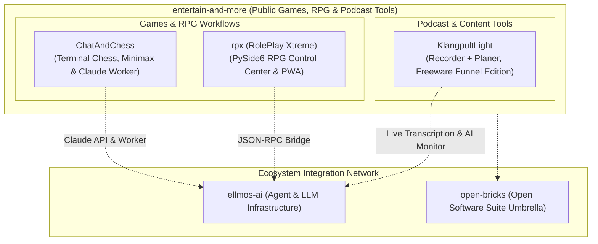

  

  
  
  
  
  
  
  
  
  
  

# entertain-and-more

[🇬🇧 English](README.md) | [🇩🇪 Deutsche Version](README_de.md)

**Local-first games, AI-assisted RPG game-master workflows, and local podcast production tooling.**

entertain-and-more is the entertainment and media tooling branch of the `open-bricks` and `ellmos` ecosystem. Its public repositories focus on practical, inspectable local-first software: terminal chess, tabletop role-playing support systems (rpx), and local podcast production tooling (KlangpultLight). Every public application is built to keep user data local while offering optional AI enhancement layers for players, game masters, and creators.

> [!NOTE]
> **Public Navigation Index:** Refreshed against live GitHub API metadata on **2026-09-20**. Every public repository visible in `entertain-and-more` (3 active software projects plus 1 profile repository) is indexed here. Private or internal work is intentionally omitted.

> [!TIP]
> **Local-First & Offline Resilience:** The public applications in `entertain-and-more` operate fully offline by default. AI features such as Anthropic API modes, Claude Code file-worker integration, JSON-RPC control bridges, and live transcription are optional layers designed to enhance play and production workflows without requiring cloud lock-in for core functions.

## Showcase

The banners are the links; details in the tables below.

  
  
  

## Start Here

| Need | Repository | Best Entry Point |
|---|---|---|
| Play or study a Python chess game with local play, Minimax, and optional Claude modes | [ChatAndChess](https://github.com/entertain-and-more/ChatAndChess) | Rules, tactics analyzer (`chess_analyze.py`), worker mode (`--worker`), and test workflow |
| Run a tabletop RPG control center for sessions, maps, music, player screens, and AI prompts | [rpx](https://github.com/entertain-and-more/rpx) | RPX Pro dashboard, campaign bundle (`rpx-campaign-bundle-v1`), JSON-RPC, and PWA companion |
| Record and plan a podcast episode locally (freeware funnel edition) | [KlangpultLight](https://github.com/entertain-and-more/KlangpultLight) | Recorder + Planer quickstart, live transcription, teleprompter, AI monitor |
| Understand this organization profile and shared community files | [.github](https://github.com/entertain-and-more/.github) | Organization profile, issue templates, PR template, community health files, and `llms.txt` |

## System Architecture & Interaction Flow

## Public Repository Directory

Checked **2026-09-20**: the public organization currently contains 3 software applications plus 1 profile repository.

| Project | Focus | Stack | Discovery Terms | Public Activity |
|---|---|---|---|---|
| [ChatAndChess](https://github.com/entertain-and-more/ChatAndChess) | Terminal chess with local play, Minimax depth (1–5), optional Claude API mode, Claude Code worker mode (`chess.py --worker`), full chess rules, UCI input, engine-hint modes, and tactics analyzer (`chess_analyze.py`) | Python standard library, optional Anthropic API | `terminal chess`, `Python Minimax chess`, `Claude Code chess worker`, `UCI chess moves`, `engine hint chess`, `chess tactics analyzer`, `AI chess bot` | Public repo; last push **2026-07-27** |
| [rpx](https://github.com/entertain-and-more/rpx) | RPX Pro / RolePlay Xtreme: offline tabletop RPG control center for worlds, maps, characters, sound, player screens, AI prompts, JSON-RPC control, and import/exportable campaign bundles (`rpx-campaign-bundle-v1`) with offline PWA companion | Python, PySide6, JSON-RPC, static PWA companion | `RPX Pro`, `RolePlay Xtreme`, `tabletop RPG control center`, `game-master tools`, `rpx-campaign-bundle-v1`, `offline RPG PWA`, `JSON-RPC LLM control`, `soundboard` | Public repo; last push **2026-09-20** |
| [KlangpultLight](https://github.com/entertain-and-more/KlangpultLight) | Free Recorder + Planer podcast/streaming production tool with an optional commercial edition — local audio/video recording, system-audio capture, live transcription, episode planning, teleprompter, AI monitor | Python, PySide6 (Recorder), Python/HTTP (Planer) | `KlangpultLight`, `podcast recorder`, `podcast planner`, `local podcast production`, `live transcription`, `teleprompter`, `USB podcast studio freeware` | Public repo; last push **2026-09-19** |
| [.github](https://github.com/entertain-and-more/.github) | Organization profile, shared issue templates, PR template, `llms.txt`, and community defaults | GitHub profile repo | `entertain-and-more`, `organization profile`, `llms.txt`, `public repo directory`, `community templates` | Public profile repo; checked **2026-09-20** |

## Ecosystem Network

`entertain-and-more` operates as the dedicated gaming and entertainment branch within a larger open-source software and research network:

| Organization | Domain Focus | Key Repositories / Role |
|---|---|---|
| [open-bricks](https://github.com/open-bricks) | Umbrella / Dach-Organisation | Central catalog, open-source software umbrella |
| [ellmos-ai](https://github.com/ellmos-ai) | AI Agent Infrastructure | `bach`, `rinnsal`, `MarbleRun`, `skills`, `n8n-workflow-manager` |
| [file-bricks](https://github.com/file-bricks) | Desktop Data Tools | `ProFiler`, `ExplorerPro`, `ProSync`, `AmpelClip`, `ProfiPrompt` |
| [doc-bricks](https://github.com/doc-bricks) | Document & Media Systems | `DokuReader`, `MediaBrain`, `UniversalInvoiceMail`, `CleanMarkdown` |
| [dev-bricks](https://github.com/dev-bricks) | Developer & Code Tools | `DevCenter`, `apiprober`, `lock-master`, `pythonbox`, `CodeBox` |
| [research-line](https://github.com/research-line) | Open Science & Math Physics | `crm-cosmology`, `fst-nash`, `epstein-network`, `rh-even-dominance` |
| [biotec-line](https://github.com/biotec-line) | Bioinformatics | `VFDistiller`, `genotype-to-vcf` |
| [entertain-and-more](https://github.com/entertain-and-more) | Games, RPG & Podcast Tools | `ChatAndChess`, `rpx`, `KlangpultLight` |
| [assistassets-ai](https://github.com/assistassets-ai) | Local Financial Analytics | `FinancialProof` |
| [um-bruch](https://github.com/um-bruch) | Applied Health & Public Policy | Clinical risk analysis, prescribing models, systems medicine |
| [lukisch](https://github.com/lukisch) | Personal GitHub Profile | Developer portal & flagship showcases |

## Project Families

### Board games and AI-assisted play

- [ChatAndChess](https://github.com/entertain-and-more/ChatAndChess) explores a compact terminal chess interface with chat-driven interaction patterns. It is useful as a lightweight Python game codebase, a rules-and-engine testbed, and a playground for AI-assisted play modes, including Claude API play and file-based Claude Code worker runs.

### Tabletop RPG and game-master tooling

- [rpx](https://github.com/entertain-and-more/rpx) (RolePlay Xtreme) is a local-first control center for pen-and-paper role-playing sessions. It centers the human game master and supports practical session work such as maps, ambience, notes, character state, missions, a second-screen player view, JSON-RPC control for LLM workflows, import/exportable `rpx-campaign-bundle-v1` ZIP files, and an offline PWA companion.

### Local podcast production

- [KlangpultLight](https://github.com/entertain-and-more/KlangpultLight) is the free Recorder + Planer podcast production tool with an optional commercial edition. It pairs a PySide6 desktop Recorder (system-audio/video capture, live transcription) with a browser-based Planer (episode and asset planning, teleprompter, AI monitor).

## Design Principles

- **Player & Game-Master First:** AI features support human gameplay and session workflows without replacing human agency or creativity.
- **Local-First & Offline First:** Core applications remain 100% functional without cloud subscriptions or external servers.
- **Inspectable & Modifiable:** Small, clear codebases designed to be easily inspected, extended, forked, or adapted.
- **Practical Session Utility:** Features are prioritized by their real-world value at the gaming table or in the studio.
- **Ecosystem Interoperability:** Tools connect cleanly to [ellmos-ai](https://github.com/ellmos-ai), [doc-bricks](https://github.com/doc-bricks), and [open-bricks](https://github.com/open-bricks) standards.

## For Developers and LLMs

- Machine-readable organization context: [llms.txt](https://github.com/entertain-and-more/.github/blob/main/llms.txt)
- Main organization page: [github.com/entertain-and-more](https://github.com/entertain-and-more)
- Related AI infrastructure: [ellmos-ai](https://github.com/ellmos-ai)
- Broader software suite: [open-bricks](https://github.com/open-bricks)

Search phrases that lead here: `ChatAndChess terminal chess`, `Python Minimax chess tactics analyzer`, `Claude Code chess worker`, `UCI chess moves Python`, `RPX Pro tabletop RPG control center`, `RolePlay Xtreme game master tools`, `offline RPG campaign bundle`, `KlangpultLight podcast recorder`, `local podcast production freeware`, `live transcription teleprompter`, `USB podcast studio freeware`, `entertain-and-more`.
