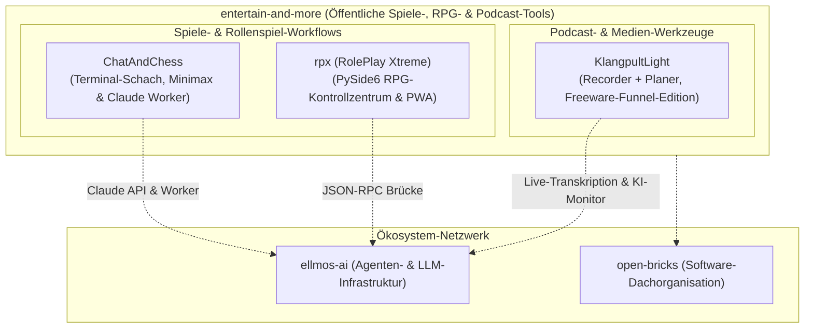

  

  
  
  
  
  
  
  
  

# entertain-and-more

[🇩🇪 Deutsch](README_de.md) | [🇬🇧 English Version](README.md)

**Lokale Spiele-, RPG- und Podcast-Werkzeuge mit optionalen KI-Funktionen.**

entertain-and-more ist der Unterhaltungs- und Medien-Werkzeugzweig des `open-bricks`- und `ellmos`-Ökosystems. Die öffentlichen Projekte sind lokal zuerst, nachvollziehbar und für den praktischen Einsatz gedacht: Terminal-Schach, Pen-and-Paper-RPG-Unterstützung (rpx) und lokale Podcast-Produktion (KlangpultLight). Jede Anwendung bewahrt die volle Datenhoheit lokal auf dem System der Nutzer und bietet optionale KI-Erweiterungen für Spieler, Spielleitungen und Medienschaffende.

> [!NOTE]
> **Öffentlicher Navigationsindex:** Abgeglichen mit der Live-GitHub-API am **2026-08-24**. Alle 3 aktiven Softwareprojekte sowie das Profil-Repository sind hier vollständig erfasst. Private oder rein interne Arbeitsstände werden im öffentlichen Profil bewusst nicht beworben.

> [!TIP]
> **Lokal-Zuerst & Offline-Betrieb:** Die öffentlichen Werkzeuge von `entertain-and-more` funktionieren standardmäßig 100% offline. KI-Funktionen wie Anthropic-API-Anbindung, Claude-Code-Dateiarbeiter, JSON-RPC-Brücken und Live-Transkription sind optionale Ergänzungen, die Workflows erweitern, ohne Kernfunktionen an Cloud-Dienste zu binden.

## Showcase

Die Banner dienen als Direktlinks; Detailinformationen finden sich in den nachfolgenden Tabellen.

  
  

*Hinweis:* [ChatAndChess](https://github.com/entertain-and-more/ChatAndChess) ist ein reines Terminal- und CLI-Werkzeug und wird direkt im Verzeichnis unten aufgeführt.

## Einstieg

| Bedarf | Repository | Empfohlener Einstiegspunkt |
|---|---|---|
| Schach im Terminal spielen oder studieren mit Minimax-Engine & Claude-Modus | [ChatAndChess](https://github.com/entertain-and-more/ChatAndChess) | Schachregeln, Taktikanalyse, Dateiarbeiter-Modus und Test-Suite |
| Pen-and-Paper-Rollenspielsitzungen steuern (Karten, Musik, Spielschirm, KI) | [rpx](https://github.com/entertain-and-more/rpx) | RPX Pro Dashboard, Kampagnenbündel, JSON-RPC und PWA-Begleiter |
| Podcast-Folgen lokal aufnehmen und strukturieren (kostenlose Funnel-Edition) | [KlangpultLight](https://github.com/entertain-and-more/KlangpultLight) | Recorder + Planer Schnellstart, Live-Transkription, Teleprompter |
| Organisationsprofil und geteilte Community-Standards verstehen | [.github](https://github.com/entertain-and-more/.github) | Organisationsprofil, Vorlagen für Issues/PRs und `llms.txt` |

## Architektur und Zusammenspiel

## Öffentlicher Repository-Index

Geprüft am **2026-08-24**: Die Organisation umfasst derzeit 3 öffentliche Softwareanwendungen und 1 Profil-Repository.

| Projekt | Schwerpunkt | Technologie-Stack | Suchbegriffe | Öffentliche Aktivität |
|---|---|---|---|---|
| [ChatAndChess](https://github.com/entertain-and-more/ChatAndChess) | Terminal-Schach mit lokalem 2-Spieler-Modus, Minimax-Tiefe, optionalem Claude-API-Modus, Claude-Code-Dateiarbeiter, vollständigen Schachregeln, UCI-Eingabe, Engine-Hinweisen und Taktikanalyse | Python Standardbibliothek, optionale Anthropic-API | `terminal chess`, `Python Minimax chess`, `Claude Code chess worker`, `UCI chess moves`, `engine hint chess`, `chess tactics analyzer` | Öffentliches Repo; letzter Push **2026-07-27** |
| [rpx](https://github.com/entertain-and-more/rpx) | RPX Pro / RolePlay Xtreme: Offline-Kontrollzentrum für Pen-and-Paper-Spielleitung, Welten, Karten, Charaktere, Sound, Spielerschirm, KI-Prompts, JSON-RPC-Steuerung und importierbare Kampagnenbündel | Python, PySide6, JSON-RPC, statische PWA | `RPX Pro`, `RolePlay Xtreme`, `tabletop RPG control center`, `game-master tools`, `rpx-campaign-bundle-v1`, `offline RPG PWA`, `JSON-RPC LLM control` | Öffentliches Repo; letzter Push **2026-08-14** |
| [KlangpultLight](https://github.com/entertain-and-more/KlangpultLight) | Kostenloses Recorder- und Planer-Werkzeug für Podcast- und Streaming-Produktion mit optionaler kommerzieller Edition — lokale Aufnahme, Live-Transkription, Episodenplanung, Teleprompter, KI-Monitor | Python, PySide6 (Recorder), Python/HTTP (Planer) | `KlangpultLight`, `podcast recorder`, `podcast planner`, `local podcast production`, `live transcription`, `teleprompter`, `USB podcast studio freeware` | Öffentliches Repo; letzter Push **2026-08-24** |
| [.github](https://github.com/entertain-and-more/.github) | Organisationsprofil, Standard-Issue- und PR-Templates, llms.txt und Community-Standards | GitHub Profil-Repository | `entertain-and-more`, `organization profile`, `llms.txt`, `public repo directory` | Öffentliches Profil-Repo; geprüft **2026-08-24** |

## Ökosystem-Netzwerk

`entertain-and-more` bildet den spezialisierten Unterhaltungs- und Medienzweig innerhalb eines vernetzten Open-Source-Ökosystems:

| Organisation | Fachbereich | Relevante Repositories / Rolle |
|---|---|---|
| [open-bricks](https://github.com/open-bricks) | Dachorganisation | Gesamtkatalog aller Desktop-Apps und Bibliotheken |
| [ellmos-ai](https://github.com/ellmos-ai) | KI- & Agenten-Infrastruktur | `bach`, `rinnsal`, `MarbleRun`, `skills`, `n8n-workflow-manager` |
| [file-bricks](https://github.com/file-bricks) | Datei- & Datenwerkzeuge | `ProFiler`, `ExplorerPro`, `ProSync`, `AmpelClip`, `ProfiPrompt` |
| [doc-bricks](https://github.com/doc-bricks) | Dokumenten- & Mediensysteme | `DokuReader`, `MediaBrain`, `UniversalInvoiceMail`, `CleanMarkdown` |
| [dev-bricks](https://github.com/dev-bricks) | Entwickler-Werkzeuge | `DevCenter`, `apiprober`, `lock-master`, `pythonbox`, `CodeBox` |
| [research-line](https://github.com/research-line) | Offene Forschung & mathematische Physik | `crm-cosmology`, `fst-nash`, `epstein-network`, `rh-even-dominance` |
| [biotec-line](https://github.com/biotec-line) | Bioinformatik | `VFDistiller`, `genotype-to-vcf` |
| [assistassets-ai](https://github.com/assistassets-ai) | Lokale Finanzanalyse | `FinancialProof` |
| [entertain-and-more](https://github.com/entertain-and-more) | Spiele, RPG- & Podcast-Tools | `ChatAndChess`, `rpx`, `KlangpultLight` |
| [lukisch](https://github.com/lukisch) | Entwickler-Hauptprofil | Flaggschiff-Projekte und Portfolio-Übersicht |

## Projektfamilien

### Brettspiele und KI-unterstütztes Spiel

- [ChatAndChess](https://github.com/entertain-and-more/ChatAndChess) realisiert ein kompaktes Schachspiel für das Terminal mit textbasierten Interaktionsmustern. Es dient als leichtgewichtige Python-Codebasis, Testumgebung für Schachregeln und Taktikalgorithmen sowie als Erprobungsfeld für KI-Spielmodi (Claude API und dateibasierte Claude-Code-Arbeiter).

### Pen-and-Paper-RPG und Spielleitungs-Werkzeuge

- [rpx](https://github.com/entertain-and-more/rpx) (RolePlay Xtreme) ist eine lokal betriebene Steuerzentrale für Pen-and-Paper-Rollenspielsitzungen. Das Werkzeug stellt die Spielleitung in den Mittelpunkt und unterstützt praktische Vor-Ort-Abläufe: Kartenanzeige, Hintergrundmusik, Notizen, Charakterzustände, Missionen, ein separater Spielerschirm für Zweitmonitore, JSON-RPC-Schnittstellen für LLM-Agenten, portable `rpx-campaign-bundle-v1` ZIP-Dateien und ein offlinefähiger PWA-Begleiter.

### Lokale Podcast-Produktion

- [KlangpultLight](https://github.com/entertain-and-more/KlangpultLight) ist das kostenlose Recorder- und Planer-Werkzeug mit optionaler kommerzieller Edition. Es kombiniert einen PySide6-Desktop-Recorder (System-Audio/Video-Aufnahme, Live-Transkription) mit einem browserbasierten Planer (Episoden- und Asset-Planung, Teleprompter, KI-Monitor).

## Design- und Entwicklungsprinzipien

- **Mensch und Spielleitung zuerst:** KI-Funktionen unterstützen Spielleitung und Kreativität, ohne menschliche Entscheidungen oder Gestaltungskraft zu ersetzen.
- **Lokal zuerst & Offline-Betrieb:** Die Kernanwendungen funktionieren vollständig autonom ohne Cloud-Zwang oder externe Server.
- **Prüfbar und anpassbar:** Kompakte, saubere Codebasen ermöglichen einfache Code-Audits, Erweiterungen und Anpassungen.
- **Praktischer Nutzen am Spieltisch:** Features werden nach ihrem konkreten Mehrwert am Spieltisch oder im Aufnahmestudio priorisiert.
- **Ökosystem-Kompatibilität:** Saubere Schnittstellen zu [ellmos-ai](https://github.com/ellmos-ai), [doc-bricks](https://github.com/doc-bricks) und den [open-bricks](https://github.com/open-bricks)-Standards.

## Für Entwickler und KI-Agenten

- Maschinenlesbarer Kontext: [llms.txt](https://github.com/entertain-and-more/.github/blob/main/llms.txt)
- Organisations-Hauptseite: [github.com/entertain-and-more](https://github.com/entertain-and-more)
- Verwandte KI-Infrastruktur: [ellmos-ai](https://github.com/ellmos-ai)
- Übergreifende Software-Suite: [open-bricks](https://github.com/open-bricks)

Suchbegriffe: `ChatAndChess terminal chess`, `Python Minimax chess tactics analyzer`, `Claude Code chess worker`, `UCI chess moves Python`, `RPX Pro tabletop RPG control center`, `RolePlay Xtreme game master tools`, `offline RPG campaign bundle`, `KlangpultLight podcast recorder`, `local podcast production freeware`, `live transcription teleprompter`, `USB podcast studio freeware`, `entertain-and-more`.
