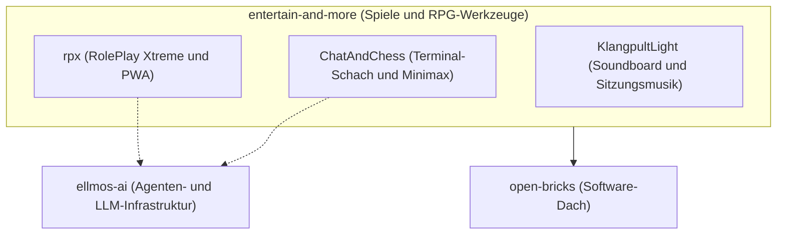

# entertain-and-more

[English version](README.md)

**Lokale Spiele- und RPG-Werkzeuge mit optionalen KI-Funktionen.**

entertain-and-more ist der Spiele- und Unterhaltungszweig des `open-bricks`- und `ellmos`-Ökosystems. Die öffentlichen Projekte sind lokal zuerst, nachvollziehbar und für den praktischen Einsatz gedacht.

> [!HINWEIS]
> **Öffentlicher Navigationsindex:** Abgeglichen mit der Live-GitHub-API am **2026-08-01**. Alle 3 öffentlichen Softwareprojekte und das Profil-Repository sind hier erfasst; private oder interne Projekte werden bewusst nicht genannt.

## Einstieg

| Bedarf | Repository | Schwerpunkt |
|---|---|---|
| Schach im Terminal spielen oder untersuchen | [ChatAndChess](https://github.com/entertain-and-more/ChatAndChess) | Python, Minimax, optionale Claude- und Worker-Modi |
| Pen-and-Paper-RPG-Sitzungen steuern | [rpx](https://github.com/entertain-and-more/rpx) | Karten, Figuren, Sound, Spielschirm, JSON-RPC und PWA |
| Soundboard und Musik für eine Spielrunde nutzen | [KlangpultLight](https://github.com/entertain-and-more/KlangpultLight) | Leichtgewichtiges Python-Werkzeug für Live-Sitzungen |
| Organisationsprofil und Community-Dateien verstehen | [.github](https://github.com/entertain-and-more/.github) | Profil, Vorlagen und maschinenlesbarer Index |

## Architektur und Zusammenspiel

## Öffentlicher Repository-Index

| Projekt | Zweck | Öffentliche Aktivität |
|---|---|---|
| [ChatAndChess](https://github.com/entertain-and-more/ChatAndChess) | Terminal-Schach mit Minimax, Regeln, Taktikanalyse und optionalen Claude-Modi | Letzter Push: **2026-07-27** |
| [rpx](https://github.com/entertain-and-more/rpx) | Lokales RPG-Kontrollzentrum für Spielleitung, Karten, Sound, Spielschirm und LLM-Steuerung | Letzter Push: **2026-07-26** |
| [KlangpultLight](https://github.com/entertain-and-more/KlangpultLight) | Leichtgewichtiges Python-Soundboard und Musiksteuerung für Live-Spielrunden | Letzter Push: **2026-07-31** |
| [.github](https://github.com/entertain-and-more/.github) | Organisationsprofil, Community-Vorlagen und `llms.txt` | Geprüft: **2026-08-01** |

## Grundsätze

- **Menschen und Spielleitung zuerst:** KI unterstützt Spiel und Vorbereitung, ersetzt aber keine menschliche Gestaltung.
- **Lokal zuerst und offline-fähig:** Die Kernfunktionen benötigen keine Cloud-Abonnements.
- **Nachvollziehbar und anpassbar:** Kleine, verständliche Projekte erleichtern Prüfung, Forks und Erweiterungen.
- **Ökosystem-kompatibel:** Die Werkzeuge verweisen sauber auf [ellmos-ai](https://github.com/ellmos-ai) und [open-bricks](https://github.com/open-bricks).

Maschinenlesbarer Kontext: [llms.txt](../llms.txt) · Organisation: [github.com/entertain-and-more](https://github.com/entertain-and-more)
